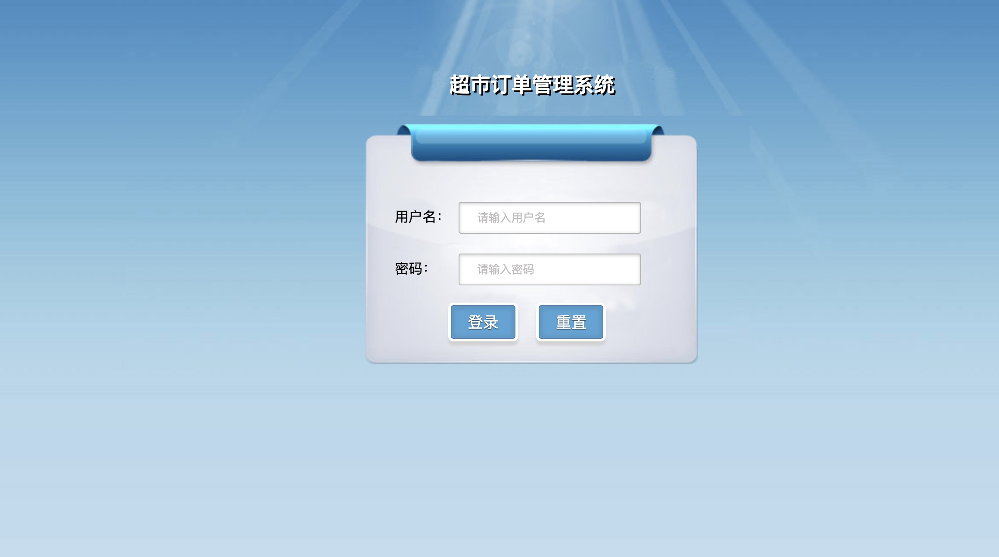
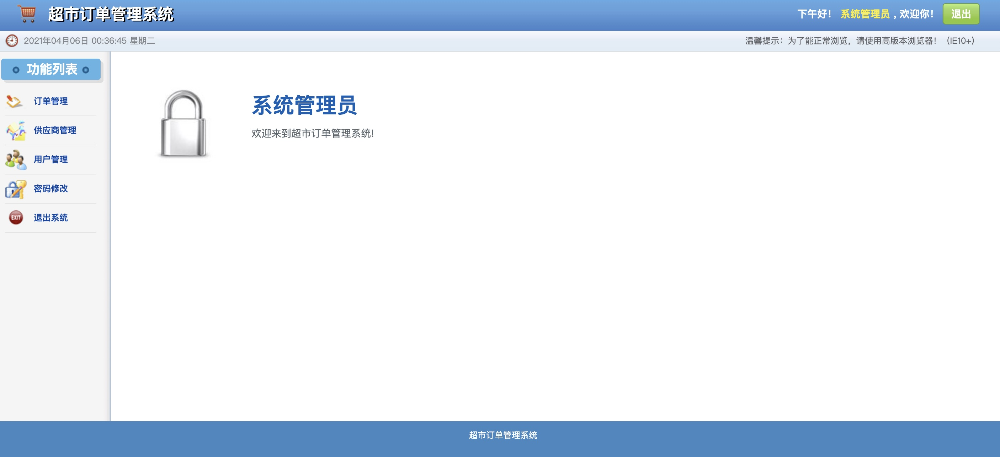

## Description

This is a project made by Jinhao Zhang during the period when he was learning JavaWeb taught by Kuangshen. Kuangshen's
website page:  [首页-KuangStudy](https://www.kuangstudy.com/). SMBMS stands for Small/Mid-sized Billing Management System.
This project didn't use any kind of frame work (The reason is very simple: I had not learned that part).

The web static resources, including css, js, images, calendar, jsp under webapp folder, was imported
from [smbms静态资源.rar下载-CSDN论坛](https://bbs.csdn.net/topics/399066270). The entire work was based on these available
front-end web files.

This program now is able to do some operations as follows:

* login and logout the management system
* block unauthorized access
* change the password

## dependency

##### Basic

* MySQL 8.0.23
* Tomcat 9.0.44
* Java 13 (over 9)
* Maven 3.6.3

##### Personal choice

* IDE: Intellij IDEA Ultimate 2020.3
* Web browser: Edge

##### Maven dependencies

* junit:junit:4.12
* javax.servlet:servlet-api:2.5
* javax.servlet.jsp:javax.servlet.jsp-api:2.3.3
* mysql:mysql-connector-java:8.0.23
* javax.servlet.jsp.jstl:jstl-api:1.2
* taglibs:standard:1.1.2
* com.alibaba:fastjson:1.2.61

## Setup

In order to run this program:

1. build the database. Use smbms.sql file to build it. Make sure your MySQL driver is on (my version is 8.0.23).
2. Connect it to Tomcat (my version is 9.0.44) so program is able to run Servlet.

## Display

The Login Page

The Home Page

## Duration

Start Time: 4/4/2021 02:49 End Time: to be continued...